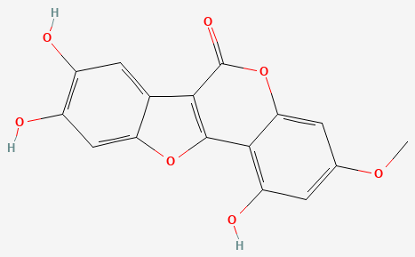
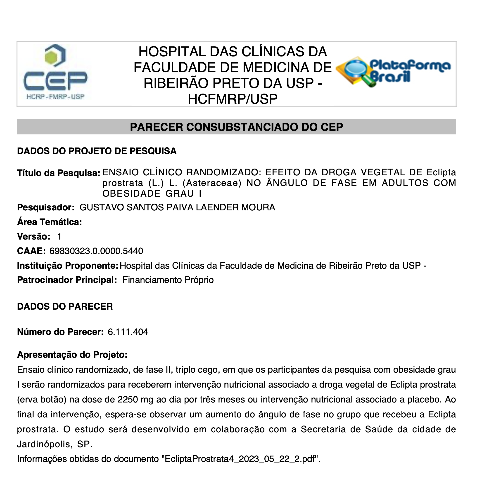
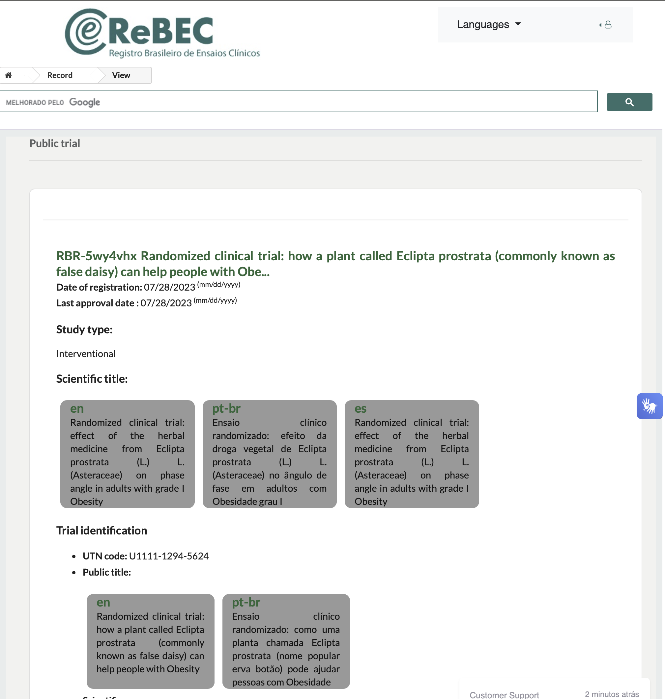
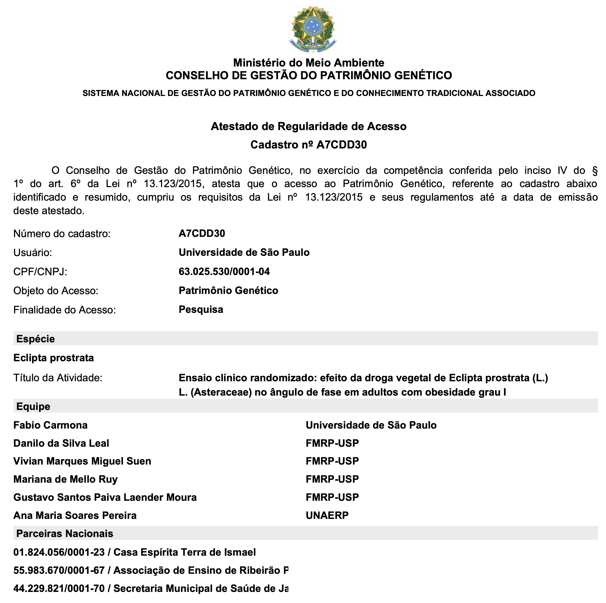
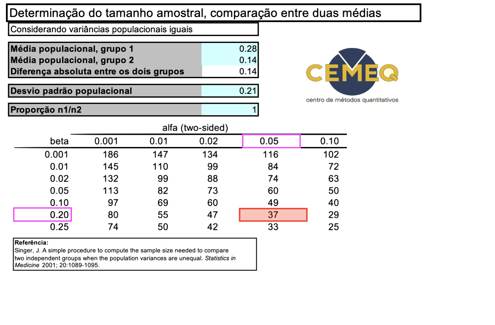

```{r setup, include = FALSE}
library(here)
library(xaringan)
library(knitr)
library(tidyverse)
library(NHSRtheme)
# set default options
opts_chunk$set(echo = FALSE,
               fig.width = 7.252,
               fig.height = 4,
               dpi = 300)

# uncomment the following lines if you want to use the NHS-R theme colours by default
scale_fill_continuous <- partial(scale_fill_nhs, discrete = FALSE)
scale_fill_discrete <- partial(scale_fill_nhs, discrete = TRUE)
scale_colour_continuous <- partial(scale_colour_nhs, discrete = FALSE)
scale_colour_discrete <- partial(scale_colour_nhs, discrete = TRUE)
```

class: title-slide, left, middle
background-image: url(img/xaringan.png), url(img/logo-title-slide.png)
background-position: 97% 95%, 95% 7%
background-size: 10%, 33%

<br/>
# .my-blue[`r rmarkdown::metadata$title`]
----
## **`r rmarkdown::metadata$subtitle`**
<br/>
### .blue[`r rmarkdown::metadata$author`]
### .blue[`r rmarkdown::metadata$date`]

---
class: inverse, middle, center

# Introdução / Justificativa
____

---
layout:true

## Eclipta *prostrata* (L.) L. *(Asteraceae)*

---
class: top, left
background-image: url(img/eclipta.png)
background-position: 95% 65%
background-size: 25%

.pull-left-wide[
<br/>
- Erva ereta ou prostrada, perene ou de curta duração .small[(Robineau et al., 2014)].
- Gênero *Eclipta* .small[([NCBI:txid53718](https://www.ncbi.nlm.nih.gov/Taxonomy/Browser/wwwtax.cgi?mode=Info&id=53718&lvl=3&lin=f&keep=1&srchmode=1&unlock))] e à família Asteraceae .small[([NCBI:txid4210](https://www.ncbi.nlm.nih.gov/Taxonomy/Browser/wwwtax.cgi?mode=Info&id=4210&lvl=3&lin=f&keep=1&srchmode=1&unlock))].
- Primeira descrição por Linné em *Mantissa plantarum* .small[(LINNÉ, 1771)]

** Uso tradicional** no Ayurveda - *Charaka Samhita*, séc. II A.C. .small[BHAVANA; SHREEVATHSA, 2014]. 

- Estudos etnofarmacológicos registram seu uso em diversos países 
<br/>.small[(Feng et al., 2019; Kaur et al., 2020; Kyaw et al., 2021)].

]

.footnote[Fonte: arquivo pessoal, Farmácia da Natureza, Jardinópolis - SP]

---
class: top, left

.pull-left[
** Compostos bioativos**
- **Complexo fitoterápico:** cumestanos, saponinas triterpênicas e esteroidais, triterpenos, esteroides, flavonoides, ácidos fenólicos, entre outros .small[(Timalsina & Devkota, 2021)].
Mais de 150 fitoconstituintes já foram identificados .small[(Timalsina & Devkota, 2021)].

- **Principal marcador:** Wedelolactona .small[([PubChem CID 5281813](https://pubchem.ncbi.nlm.nih.gov/compound/Wedelolactone); Kim et al., 2023)]
]
.pull-right[
<br/>
.small[Fonte: [PubChem](https://pubchem.ncbi.nlm.nih.gov/compound/Wedelolactone)]
]

---

### *Evidências Pré-Clínicas*

- .my-coral[**Atividade Anti-inflamatória**;]<br/> .small[(Bhattacharyya & Law, 2022; Kumar et al., 2005; Tewtrakul et al., 2011; Kang et al., 2022)].

- .my-coral[**Atividades Hipolipemiante**;] <br/>.small[(Timalsina & Devkota, 2021)]

- .my-coral[**Atividades Hipoglicemiante**;] <br/>.small[(Le et al., 2021; Yao et al., 2022; Gupta et al., 2017; Gupta et al., 2018)]

- .my-coral[**Atividade Ansiolítica**.] <br/>.small[(Banji et al., 2010; Lobo & Manavalan, 2008)]

---

### *Evidências Clínicas*

**.my-coral[Efeito Anti-hipertensivo, Diurético e Hipocolesterolemiante**]
- Ensaios clínicos demonstraram reduções significativas na pressão arterial (PAS, PAD e PAM) e melhora no perfil lipídico .small[(Rangineni et al., 2007)].

**.my-coral[Efeito Anti-hiperglicemiante**]
- Ensaios randomizados mostram redução da glicemia de jejum e pós-prandial, com desempenho comparável à metformina .small[(Sazia et al., 2015a; Sazia et al., 2015b; Hasan et al., 2013)].

---

### *Ensaios Clínicas Fase II*

.my-blue[***Rangineni; Sharada; Saxena (2007)***:]
- 73 homens sedentários (40–55 anos) com HAS leve; 60 completaram o estudo.
  - *Grupo Eclipta* (n = 30): 1g 3x/d por 60 dias.
  - *Controle:* cápsulas placebo.

- **Resultados:**
  - .my-coral[PA]: Redução de 19% na PAS, 12% na PAD e 15% na PAM.
  - .my-coral[Lipídios]: Redução de 17% no colesterol total, 24% no LDL-c, 14% nos triglicerídeos e 24% na VLDL.
  - .my-coral[Urina]: Aumento de 34% no volume urinário e 24% na fração de excreção de sódio (p < 0,01).

---

### *Ensaios Clínicas Fase II*

.my-blue[***Sazia et al. (2015):***]
  - 48 pacientes recém-diagnosticados com DM2 (20–60 anos), randomizados 1:1.  
    - *Grupo Eclipta*: 800 mg 3×/dia por 3 meses.  
    - *Controle:* Dieta para diabéticos e mudanças de estilo de vida (MEV).  
  - **Resultados:** Redução significativa na glicemia de jejum (p<0,05) e pós-prandial (p<0,01) em todas as aferições.

.my-blue[***Hasan et al. (2013):***]
  - Em 72 pacientes DM2, 
    - *Grupo Eclipta*: 800 mg 3×/dia por 3 meses.  
    - *Controle:* Orientação dietética e MEV
    - *Grupo metformina:* metformina 500 mg 1x/d
  - **Resultados:** EP melhorou significativamente a glicemia pré e pós prandial e o perfil lipídico, com resultados comparáveis aos obtidos com a metformina.

---

layout: false

## Justificativa

- A obesidade está associada à .my-blue[inflamação crônica de baixo grau]  
  .small[*(LUO & LIN, 2021; KINLEN, CODY & O’SHEA, 2018)*]


- A inflamação é proposta como o mecanismo central que liga a obesidade às .my-blue[complicações metabólicas e cardiovasculares] .small[*(KINLEN, CODY & O’SHEA, 2018; LUO & LIN, 2021)*]


- A OMS e o Ministério da Saúde incentivam pesquisas clínicas com .my-blue[fitoterápicos] .small[*(WHO, 2005; MINISTÉRIO DA SAÚDE, 2008)*]


- A *Eclipta prostrata* apresenta atividade .my-blue[anti-inflamatória] documentada .small[*(BHATTACHARYYA & LAW, 2022; KANG et al., 2022)*]


- A segurança do uso em humanos está documentada, sem registros de .my-blue[toxicidade] nas doses tradicionais .small[*(GERMOSÉN-ROBINEAU, 2005; PEREIRA et al., 2020a)*]


- O .my-blue[ângulo de fase] é um marcador sensível para detectar inflamação crônica de baixo grau .small[*(BOSY-WESTPHAL et al., 2006; YAMADA et al., 2022)*]

---

layout: false
class: inverse, middle, center

# Hipótese
____

---

class: middle, left
    ## Hipótese

----

Em indivíduos com .my-coral[obesidade grau I] submetidos ao tratamento convencional para perda de peso com intervenção nutricional, a administração da **droga vegetal de _Eclipta prostrata_**, na dose de `750 mg por via oral, três vezes ao dia`, durante um período de `3 meses`, resulta em um aumento estatisticamente significativo do ângulo de fase em comparação com o grupo placebo.

---
class: inverse, middle, center

# Objetivos
____

---
    # Objetivos
## Objetivo geral

Avaliar a atividade anti-inflamatória da **droga vegetal de _Eclipta prostrata_** em indivíduos com .my-coral[obesidade grau I] submetidos ao tratamento convencional para perda de peso com intervenção nutricional, por meio do impacto no ângulo de fase derivado da análise de impedância bioelétrica, em comparação ao placebo.

---
layout: true

## Objetivos específicos

---

### Descrever o perfil epidemiológico
1. idade;
1. sexo; 
1. etnia autodeclarada;
1. hábitos de vida: tabagismo, etilismo, atividade física e hábitos alimentares; 
1. comorbidades e medicamentos de uso contínuo.

### Avaliar a segurança da intervenção

1. Parâmetros clínicos;
1. Exames laboratoriais para monitorizar sinais de toxicidade assintomática
1. Eletrocardiografia.

---

.my-blue[**Efeito da droga vegetal de _Eclipta prostrata_:**]

1. .my-blue[***Desfecho primário:***] ângulo de fase derivado da BIA; 
1. .my-blue[***Desfecho secundário:***] proteína C reativa sérica.

### Desfechos exploratórios
1. Pressão arterial;
1. Lipídios séricos (colesterol total, LDL-c, HDL-c, triglicerídeos);
1. Perfil glicêmico (glicemia de jejum, hemoglobina glicosilada).

---
class: inverse, middle, center
layout: false

# Materiais e Métodos
____

---
name: ethics
## Aspectos Éticos

.pull-left[
- **Boas Práticas para Pesquisa Clínicas**
  ([ICH Guidelines](http://www.ich.org/home.html))

- **Aprovação Ética:** Comitê de Ética em Pesquisa da FMRP-USP  
  
- **Registro do Estudo na plataforma [REBEC](https://ensaiosclinicos.gov.br/rg/RBR-5wy4vhx)  **
  
- **Acesso ao Patrimônio Genético** da *Eclipta prostrata*  conforme a Lei nº 13.123/2015 (Atestado de Regularidade de Acesso nº A7CDD30)
]
---

template: ethics


.pull-right[
]

---

template: ethics


.pull-right[
]
---

template: ethics


.pull-right[
]
---

layout: false
## Determinação da Dose
 ###Droga Vegetal de *Eclipta Prostrata*###

- **Regulação:** Ensaios clínicos devem utilizar a mesma dose e posologia do .my-coral[uso tradicional] <br/>.small[[ANVISA (2014), MS (2008) e WHO (2005)]].

- **Uso Tradicional:** .my-coral[2 a 3 g/dia], de forma fracionada. <br/>.small[(Kambli; Khaires; Kushwaha, 2022)].

- **Ensaios Clínicos Anteriores:**  
  - Rangineni; Sharada; Saxena (2007) utilizaram .my-coral[3 g/dia];  
  - Hasan et al. (2013) e Sazia et al. (2015a, 2015b) utilizaram .my-coral[2,4 g/dia].
  
---

 ## Determinação da Dose 
 ### Droga Vegetal de *Eclipta Prostrata*

<br/>***Dose Adotada no Estudo***

.my-red[_750 mg, 3 vezes ao dia (totalizando 2250 mg/dia), administrada com café da manhã, almoço e jantar.]_<br/>

<br/>**Equivalência à Dose Máxima Recomendada:** 

.my-red[_13,8% da dose máxima_] recomendada para ensaios clínicos, com base em estudos de toxicidade em modelo animal .small[(FDA, 2005)].

---

## Cálculo do Tamanho Amostral
**Dados Populacionais:**  
- 214.732 adultos na Alemanha - ângulo de fase estratificado por idade, sexo e IMC: <br/> .my-coral[_Ângulo de fase < percentil 10 se correlacionou com PCR elevada_.] .small[(BOSY-WESTPHAL et al., 2006)].

- Estudo na **população brasileira**, em 2122 indivíduos [22,5% com IMC > 30 kg/m²], apresentou resultados semelhantes .small[(MATTIELLO; MUNDSTOCK; ZIEGELMANN, 2022)].

**Relação entre Média e Percentil 10:**  

.my-coral[_A média populacional do AF foi 15% maior que o percentil 10, com diferença média de 0,84°_]<br/> .small[(0,78° para mulheres e 0,89° para homens).]

**Premissa de Benefício Clínico:**  

Consideramos clinicamente relevante um incremento de 0,28° (um terço de 0,84°) associado a intervenção.
---


???

- **Parâmetros para o Cálculo [comparação entre 2 médias]:**  
  - .my-blue[Grupo _Eclipta_:] incremento médio de .my-red[0,28°];  
  - .my-blue[Grupo placebo:] incremento médio de .my-red[0,14°] .small[(50% do do grupo DVEP - efeito placebo e Hawthorne)];  
  - .my-blue[Desvio padrão médio]: 0,21°.

- **Tamanho Amostral:**  
  Com nível de significância de 0,05 (bicaudal) e poder de 80%, obteve-se um tamanho amostral de 37 participantes por grupo .small[(SINGER, 2001)].

---

## Gestão de Dados

**[Plano de Gestão de Dados](https://doi.org/10.48321/D1N34D):** DMPTool usando o template Digital Curation Centre.  

**Plataforma de Coleta:** Instância FMRP do 

**Projetos REDCap:** .my-coral[*os links dão acesso direto aos codebooks*]
- **Projeto Principal ([PID 1958](https://gsplmoura.github.io/DVEP/REDCap/PID%201958%20DVEP.pdf)):** 34 instrumentos de coleta e 821 campos
- [PID 2184](https://gsplmoura.github.io/DVEP/REDCap/PID%202184%20Patient%20outreach.pdf): Para o público verificar elegibilidade;
- [PID 2246](https://gsplmoura.github.io/DVEP/REDCap/PID%202246%20Eligibility%20assessment.pdf): Para avaliação completa de elegibilidade pela equipe de pesquisa;
- [PID 2205](https://gsplmoura.github.io/DVEP/REDCap/PID%202205%20National%20Cancer%20Institute%20Thesaurus%20%7C%20REDCap.pdf): Suporte operacional com códigos do _NCIT_ para indexação de comorbidades e medicamentos.

**Confiabilidade na coleta de dados:**  
  Lógicas condicionais, campos calculados, campos redundantes e alertas para validação de resultados, assegurando a integridade dos dados.

---

## Protocolo Experimental

 ###**Tipo de Estudo**

**Ensaio clínico de intervenção, fase II, randomizado 1:1, triplo cego, controlado por placebo, com grupos paralelos.**

 ###**Intervenção** (90 dias)  
  - **Grupo _Eclipta_:** .my-blue[intervenção nutricional] + .my-coral[droga vegetal de *E. prostrata* (2250 mg/dia)];
  
  - **Grupo Placebo:** .my-blue[intervenção nutricional] + .my-coral[placebo na mesma dose e posologia].

**Cegamento:** cápsulas e frascos indistinguíveis.

**Três avaliações clínicas**: na inclusão, aos 45 dias, e aos 90 dias.

---

## Critérios de Inclusão e Não-Inclusão

 ###**Inclusão:**  

Adultos (18 a 59 anos) de ambos os gêneros com obesidade grau I, acompanhados pela ESF de Jardinópolis - SP.  
  
 ###**Não-Inclusão:**  

  - Comorbidades associadas a inflamação crônica de baixo grau;
  - Histórico de uso crônico de anti-inflamatórios ou imunossupressores; 
  - Distúrbios disabsortivos e alterações anatômicas do trato gastrointestinal;
  - Condições que interfiram na análise de impedância bioelétrica;
  - Diarreia crônica;
  - Restrição de liberdade/incapazes de consentir adequadamente.

---
class: middle, left
    ## Critérios de Exclusão

- Retirada do consentimento.

- Eventos adversos, relacionados ou não à pesquisa, conforme deliberação do **comitê de monitoramento externo**.

- Mulheres que se tornem gestantes ou desejem engravidar durante o período do estudo.

- Outros eventos imprevistos, conforme deliberação do **comitê de monitoramento externo**.

---
class: inverse, middle, center
## Seleção e Recrutamento
____

---
background-image:url(img/poster.png), url(img/jardinopolis.png)
background-position: 70% 50%, 1% 1%
background-size: 35%, 40%
---
background-image:url(img/survey_1.png)
background-size:contain
---
exclude: true
background-image:url(img/survey_2.png)
background-size:contain
---
background-image:url(img/survey_3.png)
background-size:contain
---
exclude: true
background-image:url(img/survey_4.png)
background-size:contain
---
exclude: true
background-image:url(img/survey_5.png)
background-size:contain
---
exclude: true
background-image:url(img/survey_6.png)
background-size:contain
---
exclude: true
 ###**Parceria Institucional:** 
 Colaboração com a Secretaria de Saúde de Jardinópolis-SP e divulgação via ESF.
 
 ### **Procedimento:**  
  - Potenciais participantes preenchiam formulário no REDCap;
  - Contato com potenciais participantes;
  - Verificação de elegibilidade pela equipe de pesquisa;
  - Obtenção do consentimento livre e esclarecido
  - Inclusão no estudo

---

## Randomização

- **Geração da Sequência:**  
  - [Sealed Envelope](https://www.sealedenvelope.com/simple-randomiser/v1/lists): Criada em 03/07/2023 pelo Prof. Dr. Fábio Carmona.
  - Parâmetros: blocos aleatórios de tamanho 4 ou 6, lista com 148 itens (alocação 1:1).
  - _Seed 177782464738902_
  
- **Procedimento:**  
  - A sequência foi encaminhada exclusivamente à farmácia
  - Os frascos (droga vegetal ou placebo) são idênticos, diferenciados apenas pelo rótulo que contém o número de alocação.
  - Participantes são designados por ordem de inclusão (ex.: o primeiro participante recebe o frasco com o número 1).

---
class: middle, left
## Procedimentos
.small[
```{r tabela-procedimentos, echo=FALSE, message=FALSE, warning=FALSE}
library(knitr)
tabela <- data.frame(
  Procedimentos = c("Avaliação clínica",
                    "Coleta de dados demográficos",
                    "Parâmetros de segurança: clínicos, eletrocardiográficos, laboratoriais, pressão arterial",
                    "Avaliação e quantificação da ingestão de etanol e uso de tabaco",
                    "Avaliação da prática de atividade física",
                    "Dispensação dos frascos contendo as cápsulas designadas",
                    "Avaliação da adesão à intervenção",
                    "Avaliação nutricional",
                    "Avaliação do recordatório alimentar e intervenção nutricional",
                    "Aferição de peso, altura e circunferência abdominal",
                    "Aferição da força de preensão palmar e BIA",
                    "Aplicação dos escores WHOQOL-BREF, DASS-21, ECAP"),
  T1 = c("✕", "✕", "✕", "✕", "✕", "✕", "", "✕", "✕", "✕", "✕", "✕"),
  T2 = c("✕", "", "✕", "", "✕", "✕", "✕", "✕", "", "✕", "", ""),
  T3 = c("✕", "", "✕", "✕", "✕", "", "✕", "✕", "✕", "✕", "✕", "✕")
)
kable(tabela, format = "markdown", align = "lccc")
```
Legenda: T1 – primeira avaliação clínica (dia 0); T2 – segunda avaliação clínica (dia 45); T3 – terceira avaliação clínica (dia 90)
]

---

## Medidas de Segurança

- **Medidas adotadas no estudo:**  
  - A *Eclipta prostrata* é considerada segura em humanos .small[Instrução Normativa Nº 5 (ANVISA, 2010) e RDC nº 26 (ANVISA, 2014), GERMOSÉN ROBINEAU et al. (2014)].
  - Diretrizes da OMS .small[(WHO, 2005)] e do Ministério da Saúde .small[(MS, 2008)] para **ensaios clínicos com fitoterápicos**.
  
- **Avaliações presenciais:**  
  - Avaliação clínica completa
  - Exames laboratoriais para pesquisa de toxicidade assintomática hepática, renal, musculoesquelética, hematológica e endócrino-metabólica.
  - Monitorização de toxicidade cardiovascular com avaliação clínica e ECG.
  
- **Monitoramento Contínuo:**  
  - Questionário semanal automático via REDCap: sintomas, adesão e dúvidas.  
  - Notificações (via e-mail) enviadas ao pesquisador principal caso ocorram sintomas.

---
exclude: true
class: top, left
    ### Parâmetros de Segurança Recomendados

| Sistema                       | Parâmetros de Segurança                                                                           |
|-------------------------------|---------------------------------------------------------------------------------------------------|
| **Neurológico**               | Ausência de sintomas neurológicos                                                                  |
| **Pele**                      | Ausência de reações alérgicas (evidências clínicas)                                                |
| **Musculoesquelético**        | Ausência de artrites/mialgias; valores normais de CPK                                               |
| **Gastrointestinal**          | Evidência clínica de tolerância                                                                    |
| **Fígado**                    | Valores normais de AST, ALT, FALC e bilirrubina total                                               |
| **Rim**                       | Valores normais de ureia ou creatinina                                                              |
| **Endócrino e Metabólico**    | Valores normais de albumina/proteína total, ácido úrico, glicose, colesterol, amilase/lipase, sódio/potássio e cálcio |
| **Cardiovascular**            | ECG e pressão sanguínea normais                                                                    |
| **Hematopoiético**            | Valores normais no hemograma total                                                                 |

_Fonte: MINISTÉRIO DA SAÚDE, 2008_

---
    ## Medidas de Segurança
### Comitê de Monitoramento Externo

- **Composição:**  
  - Formado por três pesquisadores com titulação mínima de Doutor.

- **Funções e Ações:**  
  - Recebemam relatórios periódicos sobre recrutamento, seguimento e parâmetros de segurança.
  - Autonomia de decidir pela exclusão de participantes ou interrupção do estudo.

---

## Manejo dos Dados e Análise Estatística

- **Definição dos Desfechos:**  
  - *Primário*: ângulo de fase pós-intervenção.
  - *Secundário*: concentração sérica de PCR.
  - *Desfechos exploratórios*: pressão arterial, parâmetros de segurança, perfil lipídico/glicêmico.

- **Fonte dos Dados:** Banco de dados longitudinal.

- **Processamento:** .small[[(APÊNDICE H – Código R)](https://gsplmoura.github.io/DVEP/1_DVEP.html)]
  - Importação e limpeza dos dados em R.
  - Recodificação e padronização das variáveis.

- **Análise exploratória** .small[[(APÊNDICE I – Código R)](https://gsplmoura.github.io/DVEP/2_DVEP_Results.html)]

---

### Modelagem Estatística

- **Objetivo:** Para as variáveis dependentes, avaliar mudanças ao longo do tempo e controlar confundidores.
- **Modelos Utilizados:**  
  - Regressão linear e modelos mistos generalizados (GLMM).
  - Inclusão de termos fixos para intervenção, tempo e interações.
  - Inclusão de termos aleatórios para capturar variabilidade interindividual.
- **Covariáveis Adicionais:** Idade, sexo e hábitos de vida.
- **Ferramentas:** Pacote [**lme4**](https://cran.r-project.org/web/packages/lme4/index.html) com seleção baseada no critério de informação de Akaike (AIC).
- **Análise de Sensibilidade**: avaliar a robustez dos resultados.
    - **Métodos:** avaliação de outliers, manejo de dados faltantes, avaliação de possíveis vieses relacionados à adesão ao tratamento e ao impacto de valores extremos.
- **Apresentação dos resultados**: estimativas com intervalos de confiança de 95%, valores de p ajustados para múltiplas comparações via método de Bonferroni.
- **Visualização:** tendências longitudinais e diferenças entre grupos ilustradas com gráficos [(**ggplot2**)](https://cran.r-project.org/web/packages/ggplot2/index.html)

---
class: inverse, middle, center

# Resultados e Discussão  
____

---
## Recrutamento

O recrutamento ocorreu entre **agosto de 2023 e julho de 2024**:
  - 668 candidatos manifestaram interesse;
  - 147 avaliações completas de elegibilidade;
  - 102 participantes elegíveis.
  - .my-coral[75 participantes incluídos]

---
class: inverse, middle, center
# Resultados e Discussão  
____

## Características Basais dos Participantes

---
layout:true

### Características Demográficas

---
____


- .my-coral[**75 participantes**], sendo .my-coral[**86,6%] do sexo feminino**.

- A **idade média** foi de .my-coral[**40,6 anos**] (IC 95% 38,3–43,0).

- Distribuição dos participantes entre os grupos:
  - **Grupo Placebo**: 37 (49,3%)
  - **Grupo _Eclipta_**: 38 (50,7%)

- A intervenção teve duração média de .my-coral[**94,4 dias] (IC 95%: 88,8–99,9)**.

---

#### Comparação entre Grupos

- **Não houve diferenças significativas** entre os grupos para:
  - Idade
  - Sexo
  - Etnia
  - Estado civil
  - Situação de emprego
  - Histórico de hipertensão arterial e resistência insulínica
  - Uso de medicamentos de uso contínuo com potencial influência no peso
  
- **Exceção**: O **nível de renda** foi significativamente diferente (_p_ = 0,01).
- A distribuição de **renda mensal** foi:
  - **Grupo Placebo**: maior proporção na faixa de **R$3.001,00 - R$5.000,00**.
  - **Grupo _Eclipta_**: maior proporção na faixa de **R$1.001,00 - R$3.000,00**.
  
---

#### Tabela: Características Basais dos Participantes

.small[
```{r echo=FALSE, message=FALSE, warning=FALSE}
library(knitr)
tabela_baseline <- data.frame(
  Característica = c("Idade em anos [média (IC95%)]",
                    "Sexo feminino (%)",
                    "Etnia branca (%)",
                    "Estado civil: Casado (%)",
                    "Emprego em tempo integral (%)",
                    "Número de coabitantes [média (IC95%)]",
                    "Tempo de estudo em anos [média (IC95%)]",
                    "Renda mensal < R$3.000 (%)",
                    "Hipertensão (%)",
                    "Resistência Insulínica ou DM2 (%)"),
  "Grupo Placebo" = c("39,9 (37,1–42,8)", "81,1", "73,0", "59,5", "73,0",
                      "3,6 (3,2–3,9)", "11,6 (10,8–12,4)", "48,6", "16,2", "24,3"),
  "Grupo Eclipta" = c("41,3 (37,7–45)", "92,1", "81,6", "71,1", "65,8",
                      "3,4 (3,0–3,8)", "10,5 (9,5–11,5)", "65,8", "31,6", "23,7"),
  "Valor p" = c("0,5641", "0,1908", "0,4864", "0,1227", "0,4160",
                "0,4623", "0,1085", "**0,0101**", "0,1981", "1,000")
)

kable(tabela_baseline, format = "markdown", align = "lccc",
      col.names = c("Característica", "Grupo Placebo (N=37)", "Grupo *Eclipta* (N=38)", "Valor p"))
```
Legenda. DM2: Diabetes Mellitus tipo 2.]


---

exclude: true

```{r}
library(ggplot2)
library(dplyr)

dados_grafico <- data.frame(
  Grupo = rep(c("Placebo", "Eclipta"), each = 2),
  Variável = rep(c("Dislipidemia", "Renda < R$3.000"), 2),
  Percentual = c(16.2, 48.6, 31.6, 65.8)
)

ggplot(dados_grafico, aes(x = Variável, y = Percentual, fill = Grupo)) +
  geom_bar(stat = "identity", position = position_dodge()) +
  labs(title = "Comparação entre Grupos - Características Selecionadas",
       x = "Característica",
       y = "Percentual (%)") +
  theme_minimal()

```

---

-   A **aleatorização foi bem-sucedida**, pois não houve diferenças significativas entre <br/> os grupos para a maioria das características basais.

-   A **diferença na renda mensal** deve ser interpretada com cautela:

    -   Perguntas baseadas em faixas podem não refletir com precisão a situação socioeconômica.  Alternativamente, questões como *"Sua renda é suficiente para atender suas necessidades?"* poderiam ser mais relevantes 
.small[(SILVEIRA, 2016)].

---

layout: true

### Exames laboratoriais

---
#### Perfil metabólico dos participantes no momento da inclusão

.small[
```{r echo=FALSE, message=FALSE, warning=FALSE}
library(knitr)
tabela_lab <- data.frame(
  "Exame Laboratorial" = c(
    "PCR (mg/L)", "Colesterol total (mg/dL)", "LDL (mg/dL)",
    "Hemoglobina Glicosilada (%)", "TAG (mg/dL)", "HDL (mg/dL)", 
    "Glicemia de jejum (mg/dL)", "Insulina (uIU/mL)"
  ),
  "Global (N=75)" = c(
    "7,4 (5,4–9,4)", "191 (183,6–198,1)", "114 (106,7–120,5)", 
    "5,5 (5,3–5,6)", "128 (114–141,4)", "54 (50,8–57,1)", 
    "86 (80,9–91,6)", "15 (11,1–19,6)"
  ),
  "Grupo Placebo" = c(
    "6,5 (4,4–8,7)", "191 (180,2–202,2)", "116 (104,9–126,1)", 
    "5,5 (5,3–5,8)", "129 (108,9–148,6)", "52 (48–56,2)", 
    "86 (79,2–93)", "17 (8,8–25,5)"
  ),
  "Grupo Eclipta" = c(
    "8,3 (5–11,6)", "190 (180,8–200,2)", "112 (102,8–120,7)", 
    "5,4 (5,1–5,7)", "127 (107,6–145,8)", "56 (51–60,5)", 
    "86 (78,1–94,8)", "14 (11,8–15,3)"
  ),
  "Valor p" = c(
    "0,385", "0,924", "0,595", 
    "0,529", "0,885", "0,252", 
    "0,951", "0,42"
  )
)

kable(tabela_lab, format = "markdown", align = "lcccc",
      col.names = c("Exame Laboratorial", "Global (N=75)", "Grupo Placebo (N=37)", "Grupo *Eclipta* (N=38)", "Valor p"))
```
Legenda. PCR – Proteína C reativa (mg/L); TAG – Triglicerídeos (mg/dL); LDL – Lipoproteína de baixa densidade (mg/dL); HDL – Lipoproteína de alta densidade (mg/dL). A última coluna corresponde a comparação entre o grupo placebo e grupo Eclipta, realizada através do teste T de Student.
]

---

class: top, left

.small[
.pull-left-wide[
```{r}

```{r echo=FALSE, message=FALSE, warning=FALSE}
library(knitr)
tabela_hep_ren <- data.frame(
  "Exame Laboratorial" = c(
    "AST (U/L)", "ALT (U/L)", "GGT (U/L)", "FALC (U/L)", "Bilirrubina (mg/dL)",
    "Amilase (U/L)", "Albumina (g/dL)", "Ureia (mg/dL)", "Creatinina (mg/dL)", "CPK (U/L)"
  ),
  "Global (N=75)" = c(
    "22,4 (20,1–24,7)", "25,8 (23,1–28,6)", "33,2 (29,3–37,2)", "78,4 (72,1–84,7)", "0,6 (0,5–0,7)",
    "58,2 (53,6–62,9)", "4,2 (4,0–4,3)", "34,1 (31,3–36,9)", "0,89 (0,81–0,97)", "108 (98,6–117,4)"
  ),
  "Grupo Placebo" = c(
    "21,8 (18,9–24,7)", "26,5 (22,8–30,2)", "34,5 (28,5–40,5)", "77,1 (69,2–85,0)", "0,6 (0,5–0,7)",
    "59,1 (52,2–65,9)", "4,2 (4,0–4,4)", "34,6 (30,1–39,1)", "0,91 (0,79–1,03)", "110 (96,2–123,8)"
  ),
  "Grupo Eclipta" = c(
    "22,9 (19,5–26,3)", "25,2 (21,7–28,7)", "31,9 (26,1–37,7)", "79,6 (70,8–88,4)", "0,6 (0,5–0,7)",
    "57,3 (49,9–64,7)", "4,2 (4,0–4,4)", "33,5 (28,6–38,4)", "0,87 (0,75–0,99)", "106 (92,5–119,5)"
  ),
  "Valor p" = c(
    "0,658", "0,789", "0,671", "0,812", "0,992",
    "0,764", "0,956", "0,712", "0,845", "0,678"
  )
)

kable(tabela_hep_ren, format = "markdown", align = "lcccc",
      col.names = c("Exame Laboratorial", "Global (N=75)", "Grupo Placebo", "Grupo *Eclipta*", "Valor p"))
```
Legenda.  AST – Aspartato aminotransferase (U/L); ALT – Alanina aminotransferase (U/L); GGT – Gama-glutamil transferase (U/L); CPK – Creatina fosfoquinase (U/L). A última coluna corresponde a comparação entre o grupo placebo e grupo Eclipta, realizada através do teste T de Student.]]<br/>

Os participantes não apresentavam alterações significativas nestes marcadores, contribuindo para a segurança do estudo e minimizando riscos de toxicidade.

---

layout:true

### Variáveis antropométricas e composição corporal

---

#### Estratificação por sexo

.small[
```{r echo=FALSE, message=FALSE, warning=FALSE}
library(knitr)
tabela_imc_pal <- data.frame(
  "Parâmetro" = c("Índice de Massa Corporal (kg/m²)", "Nível de Atividade Física (PAL)"),
  "Sexo Feminino (N=65) Média (IC 95%)" = c("34,1 (32,1–36,1)", "1,4 (1,3–1,4)"),
  "Sexo Masculino (N=10) Média (IC 95%)" = c("32,5 (31,4–33,6)", "1,4 (1,3–1,5)"),
  "Valor p" = c("0,177", "0,643")
)

kable(tabela_imc_pal, format = "markdown", align = "lccc",
      col.names = c("Parâmetro", "Sexo Feminino (N=65)", "Sexo Masculino (N=10)", "Valor p"))
```
Legenda. Média e o intervalo de confiança de 95% das variáveis IMC e nível de atividade física dos participantes, estratificados por sexo. Comparação entre os realizada através do teste T de Student.
]

Como esperado, as variáveis de composição corporal diferiram entre os sexos, à exceção do IMC.

.small[
```{r echo=FALSE, message=FALSE, warning=FALSE}
library(knitr)
tabela_af_res_reat <- data.frame(
  "Parâmetro" = c("Ângulo de Fase (°)", "Resistência (Ω)", "Reatância (Ω)"),
  "Sexo Feminino (N=65) Média (IC 95%)" = c("6,4 (6,1–6,6)", "548,1 (534,5–561,7)", "60,8 (58,5–63)"),
  "Sexo Masculino (N=10) Média (IC 95%)" = c("7,0 (6,8–7,3)", "446,1 (410,3–481,9)", "55,1 (50,7–59,5)"),
  "Valor p" = c("< 0,001*", "< 0,001*", "0,040*")
)

kable(tabela_af_res_reat, format = "markdown", align = "lccc",
      col.names = c("Parâmetro", "Sexo Feminino (N=65)", "Sexo Masculino (N=10)", "Valor p"))
```
]

---
layout:true

    ### Variáveis antropométricas e composição corporal
#### [Sexo masculino, categorizado por grupo de alocação](https://gsplmoura.github.io/DVEP/Output/Baseline/Tables/bia_males.html)

---

.pull-left[
- **Grupo *Eclipta*** (N=3)
  - Maior peso e IMC  
  - Menor ângulo de fase 
]
.pull-right[
- **Grupo Placebo** (N=7)
  - Maior reatância e ângulo de fase  
  - Menor massa livre de gordura
]

_Não houve associação entre o sexo e o grupo de alocação (p = 0,19)._

.small[
```{r echo=FALSE, message=FALSE, warning=FALSE}
bia_males <- read_csv(here("Output", "Baseline", "Tables", "bia_males.csv"))
bia_males %>% 
    slice(c(2, 3, 6, 7, 8)) %>%
    mutate(across(where(is.numeric), ~format(.x, decimal.mark = ","))) %>% 
    mutate(across(where(is.character), ~ str_replace_all(.x, "\\.", ","))) %>% 
    knitr::kable(format = "markdown", align = "lccc")
```
]

---

***Limitações***

- Pequena amostra e desequilíbrio limitam comparações:
  - variações em estado nutricional/metabólico?
  - Força de preensão similar (p=0,66)<br/>
    Influência de fatores neuromusculares?<br/>
    Limitações da análise de BIA?
- Necessidade de estudos com amostras maiores

---

layout:true

    ### Variáveis antropométricas e composição corporal
#### [Sexo feminino (n=65), categorizado por grupo de alocação](https://gsplmoura.github.io/DVEP/Output/Baseline/Tables/bia_females.html)

---

_Peso, IMC, ângulo de fase e seus componentes não diferiram entre os grupos._
.small[
```{r echo=FALSE, message=FALSE, warning=FALSE}
bia_females <- read_csv(here("Output", "Baseline", "Tables", "bia_females.csv"))
bia_females %>% 
    slice(c(2, 3, 6, 7, 8)) %>%
    mutate(across(where(is.numeric), ~format(.x, decimal.mark = ","))) %>% 
    mutate(across(where(is.character), ~ str_replace_all(.x, "\\.", ","))) %>% 
    knitr::kable(format = "markdown", align = "lccc")
```
]

---

.pull-left-narrow[<br/>**Grupo Placebo**]
.pull-right-wide[
Maior .my-coral[índice de massa livre de gordura]<br/>
Maior .my-coral[água corporal total e água extracelular]
]
.small[
```{r echo=FALSE, message=FALSE, warning=FALSE}
bia_females <- read_csv(here("Output", "Baseline", "Tables", "bia_females.csv"))
bia_females %>% 
    slice(c(14, 22, 23)) %>%
    mutate(across(where(is.numeric), ~format(.x, decimal.mark = ","))) %>% 
    mutate(across(where(is.character), ~ str_replace_all(.x, "\\.", ","))) %>% 
    knitr::kable(format = "markdown", align = "lccc")
```
]

***No entanto:***
- A .my-coral[**reatância**] não diferiu entre os grupos, contrariando a expectativa de uma reatância mais elevada no grupo com maior massa muscular.
- A .my-coral[**força de preensão palmar**] não diferiu entre os grupos ➜ Limitação no tamanho amostral? Sensibilidade da BIA? Influência de fatores neuromusculares?

---
layout: false

## Participantes que Não Completaram a Intervenção

23 participantes (30,6%) não completaram os 3 meses.
- **Por Sexo:**
  - *Homens:* 4 abandonos (40% dos homens; 2 de cada grupo de alocação).
  - *Mulheres:* 19 abandonos (8 no grupo placebo e 11 no grupo intervenção).
  
- **Testes Estatísticos** para associações entre sexo e conclusão da intervenção:
  - *Qui-quadrado de Pearson:* p = 0,750.
  - Controlando pelo grupo de alocação:<br/> *Mantel-Haenszel* p = 0,664; OR = 0,559 (IC 95%: 0,137–2,287).

???
Não houve associação entre sexo e conclusão da intervenção. 

Embora a taxa de abandono tenha sido maior nos homens, essa diferença pode ser atribuída ao acaso

---
layout:true

## Eventos Adversos e Monitoramento

---

**Avaliações Clínicas:**  
- 184 realizadas; 134 (72,8%) sem ocorrências  
- 50 registros de eventos (27,1%) em 36 participantes (1–3 eventos/participante)

**Momento e Gravidade dos Eventos:**  
- 46% dos eventos ocorreram na 3ª visita (90 dias)  
- Testes estatísticos - momento da avaliação clínica vs. gravidade dos eventos   
  - Fisher: p = 1  
  - Mantel-Haenszel (controlando pelo grupo): p = 0,956  
.my-coral[O uso da *Eclipta* não aumentou o risco de eventos graves comparado ao placebo].

---

**Tipos e Geveridade:**  
- 64% dos eventos foram leves;
- Gastrointestinais foram os mais prevalentes (36%; 88% leves);
- Eventos infecciosos representaram 12% dos registros.
- Dois eventos graves (infecciosos), ambos não associados com a intervenção.

**Monitoramento Dinâmico:**  
  - Comitê de Monitoramento teve acesso, em tempo real, a relatórios dinâmicos do  <br/> (incluindo registro completo dos eventos adversos, exames laboratoriais, ECGs, etc.)  
  - Nenhuma intervenção (interrupção ou exclusão de participantes) foi necessária
 
---
layout:false
class:inverse, middle, center

# Conclusões e Próximos Passos
____

---

background-color: #f0f0f0
layout: true
class: top, left
    ## *Conclusões e Próximos Passos*

---

###Grupos Balanceados
- Na análise exploratória dos dados basais, os grupos _Eclipta_ e Placebo foram comparáveis em quase todas as variáveis.
- Modelos estatísticos mais robustos, como regressões com inclusão de covariáveis, serão desenvolvidos para confirmar ou refutar as diferenças observadas nos parâmetros de composição corporal.

###Segurança
- O perfil de segurança foi satisfatório, com predominância de eventos leves e sem aumento de eventos adversos graves no grupo _Eclipta_.  
- Será realizada uma análise detalhada dos eventos registrados para filtrar os potenciais efeitos colaterais relacionados a *Eclipta prostrata*.

---

###Tamanho Amostral no Sexo Masculino
- O tamanho amostral limitado no sexo masculino sugere cautela na interpretação dos resultados e a necessidade de ajustes nos modelos estatísticos, além de estudos com amostras maiores.

###Taxa de Abandono
- A taxa de abandono de 30,6% pode afetar o poder estatístico e a robustez dos achados.  
- Investigar os fatores que contribuíram para esse índice, considerando a possibilidade de viés caso os abandonos não tenham ocorrido de forma aleatória.
- Investigar estratégias validadas na literatura para aumento da taxa de retenção em estudos clínicos com participantes com obesidade.

---

###Viabilidade  
- A conclusão do protocolo experimental e a robustez da coleta e manejo dos dados reforçam a viabilidade do estudo e a validade das análises futuras.

###Análises Pendentes
- Desenvolver uma variável composta que resuma a adesão à intervenção;  
- Desenvolver Modelos Lineares Generalizados Mistos para a análise do desfecho primário; 
- Concluir os testes estatísticos, incluindo análises de sensibilidade e de subgrupos, para confirmar a robustez dos achados finais.

---
layout: false
class: title-slide, left, top
background-image: url(img/farmacianatureza.png), url(img/logo-title-slide.png), url(img/jardinopolis.png), url(img/vivian.png), url(img/fabio.png), url(img/mariana.png)
background-position: 90% 55%, 90% 20%, 90% 85%, 5% 25%, 25% 25%, 5% 80%
background-size: 35%, 33%, 35%, 14%, 15%, 14%

## .my-blue[_Agradecimentos_]

---

layout:false
class:inverse
background-image:url(img/hex.png)
background-size:contain